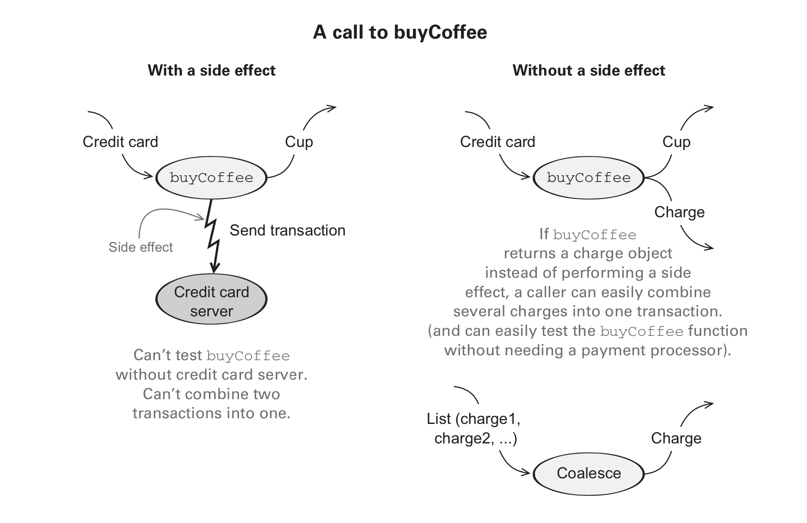

# Functional Programming in Scala

## What is FP
Side effects:
- Modifying a variable
- Modifying a data structure in place
- Setting a field on an object
- Throwing an exception or halting with an error 
- Printing to the console or reading user input
- Reading from or writing to a file
- Drawing on the screen

Instead of calling a side effect directly, just return a `charge` object 